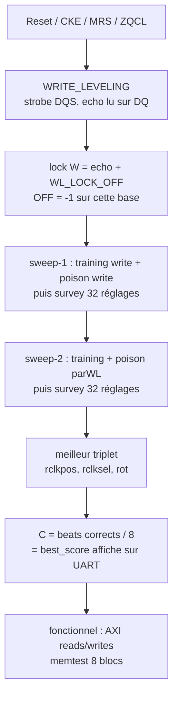
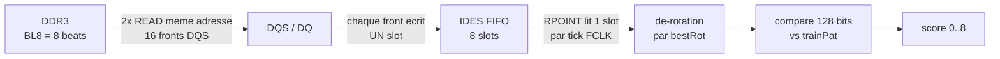
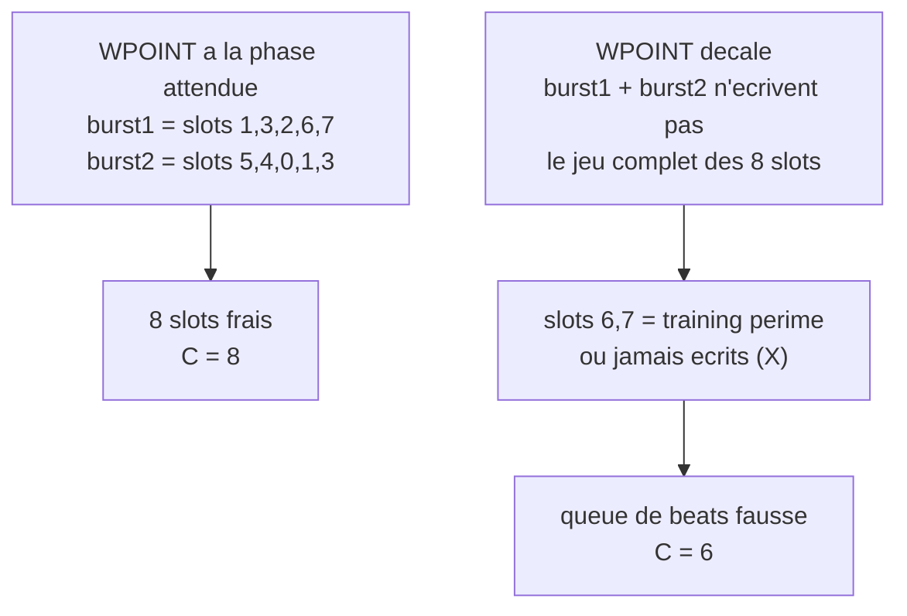
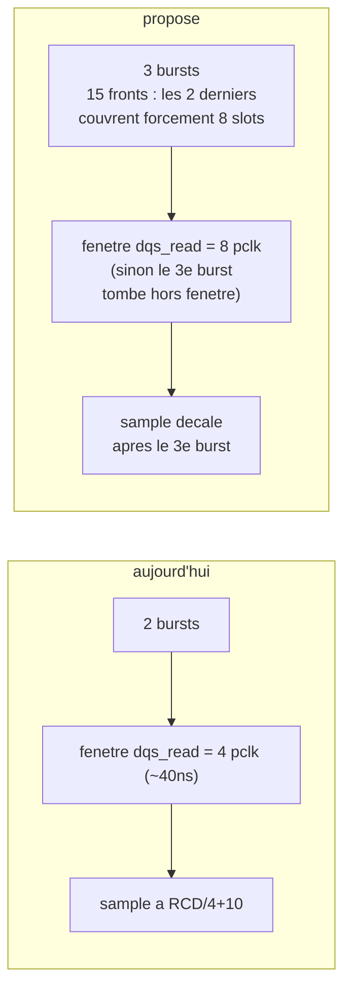

# Capture read — pourquoi `C=6` et non 8

Document de diagnostic. Objectif : expliquer en un coup d'œil ce que mesure `C`,
où la capture read peut échouer, et ce qu'on propose pour la réparer.

## 1. Ce que mesure `C`

`C` = `best_score` = meilleur **nombre de beats corrects sur 8** obtenu par le
sweep de calibration read. Ce n'est pas un compteur d'erreurs : c'est une note de
qualité de capture.



## 2. La chaîne de capture



Deux choses à retenir :

- **Un front DQS = un slot.** C'est `WPOINT` (compteur gray 3 bits) qui avance sur
  les fronts et adresse le slot ecrit. 8 slots, 8 beats : il faut exactement que
  les 8 slots reçoivent les 8 beats du burst.
- **La lecture est asynchrone.** `RPOINT` court sur FCLK libre, pas sur le strobe
  DRAM. C'est la source de la dependance a la phase que nous explicons plus bas.

## 3. Pourquoi ça rate (le défaut trouvé)

Le modele RTL/comentaire code emarque qu'**un seul burst BL8 ne remplit que
~5 slots sur 8** (preambule + 4 periodes), et que le **2e burst remplit les
slots complementaires** (gray counter) — donc la paire couvre 8.

Mais cette complementarite suppose que le **2e burst demarre avec la bonne phase**
de `WPOINT`. Si la phase a change, les deux bursts n'ecrivent pas le jeu complet :
certains slots gardent leur contenu precedent.



C'est exactement ce qu'on observe dans le testbench :

```
got = 0123456789abcdeffedcba98 1007 1006   beats 0-3 justes, 4-7 = training perime
got = 888877776666555544443333 xxxx xxxx   beats 0-5 justes, 6-7 = jamais captes
```

Les **beats de tete sont corrects** : l'alignement n'est pas faux, il est
**partiel**. Ce n'est donc pas un probleme de `rot` (que la recherche de rotation
corrigerait deja), c'est un probleme de **remplissage des slots**.

## 4. Pourquoi le testbench Micron ne le voyait pas

Le TB est **deterministe** : meme trafic a chaque run, donc la capture retombe
sur la meme phase a chaque fois — et cette phase est la bonne. `C=8` en
simulation est donc de la chance, pas une preuve.

Sur silicium, la phase est imposee par le DLL, les horloges libres (FCLK) et le
routage. Le sweep peut choisir le meilleur **reglage** de fenetre pour cette
phase, mais pas la **phase** elle-meme. D'ou `C=6` sur HW et 6/8 blocs corrects.

Le bracketing (branche `wl-bracketing`) a rendu le probleme visible : il ajoute
du trafic entre les sweeps, donc fait bouger la phase d'un round a l'autre. Il a
**revele** le defaut, il ne l'a pas cree.

## 5. Le patch propose (3 points couples)



Pourquoi 3 points et pas 1 : le 3e burst seul ne sert a rien si sa fenetre de
capture est fermee, et lire avant qu'il ait fini lit encore l'ancien contenu.
Les trois doivent bouger ensemble.

## 6. Reponses aux questions ouvertes

- **Est-ce qu'on ecrase des donnees utiles ?** Non : les 3 bursts lisent la
  **meme adresse**, donc le contenu ecrase est identique au contenu existant.
  Ecraser est l'objectif (casser les slots perimes). Le vrai contenu a
  proteger — le motif de training — est ecrit par le training write, pas par la
  capture.
- **La rotation change-t-elle ?** Oui, le shift de rotation change. Inchange : la
  recherche de rotation existente (0..7) absorbe n'importe quelle rotation, donc
  pas de travail supplementaire.
- **Risque principal ?** Le **timing JEDEC** : tCCD entre les 3 bursts (on espace
  deja de 1 pclk = 4 tCK, donc ca passe), et l'instant de sample qui doit
  decaler. Pas de risque sur le chemin d'ecriture.
- **Pourquoi une VCD d'abord ?** Les trois options (3e burst / fenetre elargie /
  sample decale) ne sont pas distinguables a la lecture du code : elles ne sont
  observables qu'en simulation. Une VCD comparative sur un seul round montre
  quel point bloque vraiment, et evite trois cycles de testbench de 40 min
  chacun.