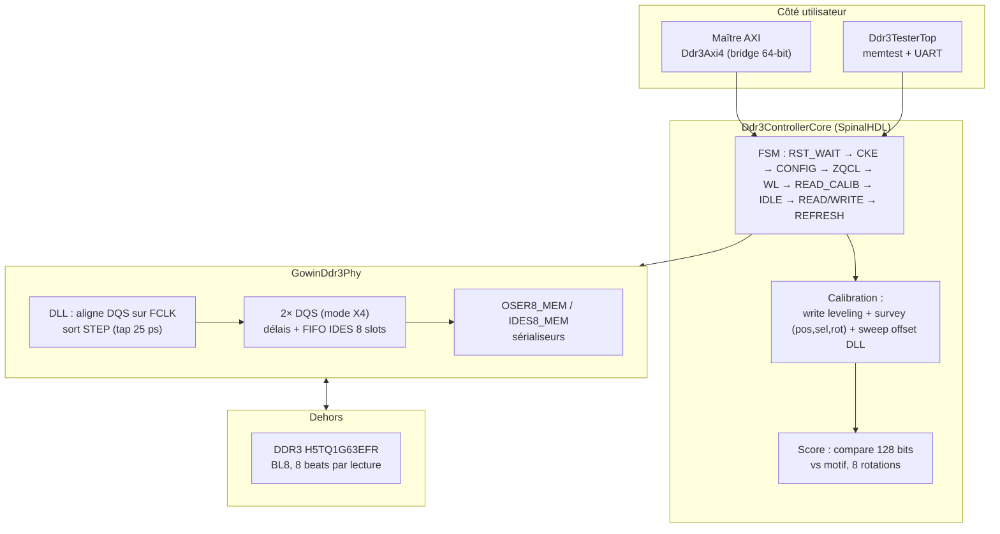
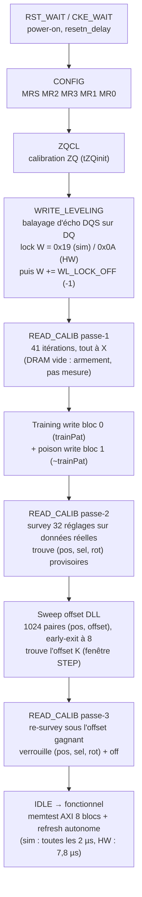
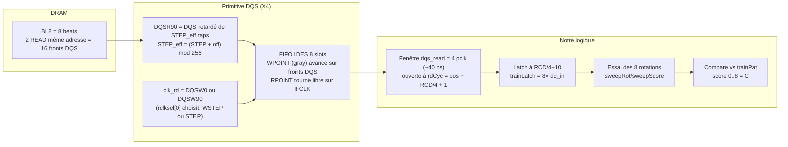
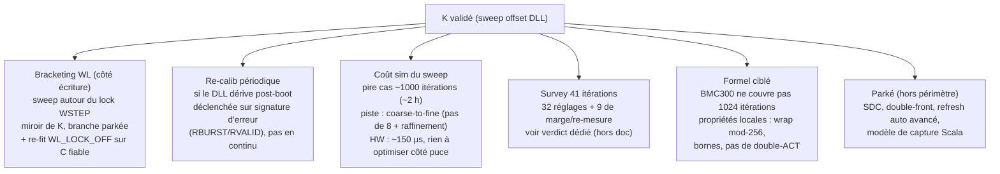

# Système DDR3 — fonctionnement actuel complet (04-10-26)

Document de référence : comment le contrôleur parle à la RAM, pourquoi le
`STEP` décide de tout, ce que fait la calibration en 3 passes + sweep K, et
les améliorations possibles (bracketing notamment).

Docs mesures : `capture-map-observations.md`, `dll-offset-K.md`,
`tb-cartographie.md`, `plan-capture-read-03-10-26.md`.

## 1. Vue d'ensemble — qui parle à qui

Chemins de données : écriture = `dq_out/dqs_out` via OSER ; lecture =
`dq_in` (8×16 bits = 128 bits) via IDES, dé-rotatés par `bestRot`.

## 2. Le boot, étape par étape

`WL_LOCK_OFF = -1` : ajustement empirique du tap d'écriture après le lock
d'écho. Côté **écriture uniquement** — les expériences montrent qu'il
n'influence pas la capture read (`STEP=25 + WSTEP=40` donne 8/8).

## 3. La chaîne de capture read (le cœur du sujet)

Points clés :
- **Un seul burst BL8 ne remplit que ~5 slots sur 8** (préambule + 4
  périodes). Le 2e burst dos-à-dos (tCCD = 1 pclk) remplit les slots gray
  complémentaires → un sample après le burst 2 voit 8 beats frais.
- **La ligne reste ouverte** pendant tout un survey/sweep (ACT en entrée de
  passe, PRECHARGE en sortie vers IDLE). Le refresh autonome ne part que
  depuis IDLE — d'où le PRECHARGE obligatoire à chaque sortie.
- **Scores quantifiés pairs (8/6/4/X)** : le compteur gray `WPOINT` saute
  parfois 2 slots par front. Pas du bruit : lisser ne servirait à rien.
- **`rclkpos` = pas de 10 ns** (ouverture de fenêtre), **`rclksel` = mux de
  routage** (8 combinaisons). Grille grossière : 4 fenêtres × 8 routages.
  Le grain fin (25 ps) vient uniquement de l'offset DLL.

## 4. L'histoire du STEP (résumé des mesures)

- Le DLL aligne le DQS sur `FCLK` et sort `STEP`. En simu le TB le force
  (`STEP=25`, raccourci des 33600 cycles de lock) ; sur HW c'est le vrai
  DLL, qui dérive (température/tension).
- Carte `STEP × phase` : phase pclk/FCLK **totalement neutre** ; seul STEP
  compte, fenêtre de **2 taps** : `{25, 26}` → 8, tout le reste → 6/4/2/0.
  Le meilleur `pos` glisse avec STEP (0 quand aligné, 2 sinon).
- Hypothèses réfutées par l'expérience : `WSTEP == STEP` (40/40 → 6,
  25/40 → 8), `sel[0]=1` invariant (aucun `sel` n'atteint 8 hors fenêtre).
- Lecture retenue : le DLL aligne, mais le FIFO veut une **marge** — un
  terme constant que seul notre offset peut ajouter. L'offset est balayé
  (jamais codé en dur, il doit suivre la dérive) : 4 `pos` × 256 offsets =
  1024 paires, early-exit à 8/8, puis passe-3 de confirmation.
- Le `C=8` historique du TB était une coïncidence (STEP forcé 25 =
  WSTEP locké 0x19 par hasard) ; le `C=6` HW = la même carte, loin de la
  fenêtre. Le sweep K rend le design auto-adaptatif au silicium réel.

## 5. Améliorations possibles (pistes, pas de décision)

- **Bracketing** : le trafic supplémentaire perturbait la mesure quand `C`
  n'était pas fiable. Avec K, chaque mesure est en lecture seule
  (pas de réécriture entre itérations) → le bracketing redevient
  envisageable côté écriture, là où K ne touche pas.
- Le sweep actuel fige `rclksel` au `bestSel` de la passe-2 (la passe-3
  re-trouve `sel/rot` sous l'offset gagnant) : un balayage 3D complet
  (8192 itérations) n'est pas nécessaire vu l'insensibilité de `sel`
  dans la fenêtre.
- Fichiers de référence : `Ddr3ControllerCore.scala` (FSM, calibration),
  `GowinDdr3Phy.scala` (`DLLSTEP := dllstep + off`), `Ddr3Controller.scala`
  (plumbing), `simulation/tb_fast.v` (`+step/+phase/+wl/+k`),
  `simulation/map_capture.py` (carte parallèle).
