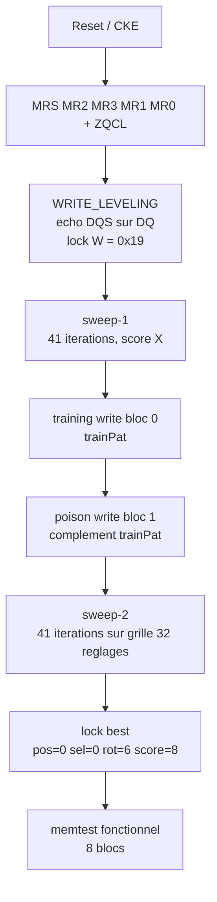
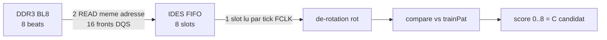

# Cartographie du testbench Micron

Document d'analyse, sans correctif. But : comprendre ce que fait réellement le
testbench `tb_spinal.v` (iverilog + modèle Micron `1024Mb_ddr3_parameters.vh`
+ primitives Gowin `DQS` / `IDES8_MEM` / `OSER8_MEM` / `DLL`), et ce que ses logs
révélent — notamment pourquoi `C` vaut 8 en simulation et 6 sur silicium.

Run de référence : `main` (`deab069`), `SPINAL SIM: ALL TESTS PASSED`.

## 1. Chronologie du boot

État enuméré `RST_WAIT=0, CKE_WAIT=1, CONFIG=2, ZQCL=3, WRITE_LEVELING=4,
READ_CALIB=5, IDLE=6, READ=7, WRITE=8, REFRESH=9`. Les traces `DBG` du TB
donnent les bornes réelles :

| Phase | État | Fenêtre (TB) | Ce qui s'y passe |
|---|---|---|---|
| Reset | 0 → 1 | ~0 → 0,1 µs |Attente power-on, pulse `resetn_delay` |
| MRS + ZQCL | 2 → 3 | 0,1 → 1,0 µs | MR2/3/1/0 puis tZQinit |
| Write leveling | 4 | 1,0 → 3,08 µs | balayage d'écho, lock `W=0x19` |
| Read calib sweep-1 | 5 | 3,09 → 4,9 µs | 41 itérations, **score = X partout** |
| Training + poison write | 8 | 4,9 → 5,1 µs | écrit `trainPat` puis son complément |
| Read calib sweep-2 | 5 | 5,1 → 8,03 µs | 41 itérations, **la vraie mesure** |
| Memtest fonctionnel | 6 → 7/8 | 8,03 µs → fin | 8 blocs AXI write/read, 0 erreur |



## 2. Cartographie des réglages

C'est le point le plus important, et il est contre-intuitif : **ce que la grille
« 32 réglages » ne fait pas**.

| Réglage | Bits | Granularité réelle | Effet physique |
|---|---|---|---|
| `wstep` | 8 | tapped line, 256 taps (~0,025 ns/tap) | délai DQS d'**écriture** (write leveling) |
| `rclkpos` | 2 | **1 pclk = 10 ns** | décale l'**ouverture de la fenêtre de capture** : `rdCyc = pos + RCD/4 + 1` |
| `rclksel` | 3 | sélection de routage | choisit parmi 8 combinaisons source/polarité/chemin du clock read dans la primitive `DQS` |
| `rot` | 3 | — | dé-rotation du mot 128 bits assemblé |
| `C` | — | 0..8 | beats corrects sur 8 |

Deux conséquences :

- **`rclkpos` n'est pas une tapped line, c'est un décalage de 10 ns.** Le
  fenêtrage utile fait ~5-10 ns : la granularité est du même ordre que la
  fenêtre. Si la relation de phase entre `pclk` et DQS n'est pas favorable,
  aucune valeur de `pos` ne tombe dans le Fenster.
- **`rclksel` ne touche pas une ligne de retard non plus** : c'est un
  multiplexeur (DQSW0 vs DQSW270, polarité, chemin `rd_dq`/`rd_dqq`). Donc la
  finesse de phase read vient du **DLL/IDES qui suit le DQS**, pas de la grille.

Autrement dit : la grille 4×8 = **4 timings de fenêtre grossiers × 8 routages
de clock**. C'est une grille grossière, pas une exploration fine de phase.

## 3. La table des 32 réglages (sweep-2, run de référence)

`score/rot` = beats corrects / rotation gagnante, pour chaque réglage :

```
pos,sel  0,0 = 8/6   0,1 = 8/6   0,2 = 8/6   0,3 = 8/6   0,4 = 8/6   0,5 = 8/6   0,6 = 8/6   0,7 = 8/6
pos,sel  1,0 = 8/6   1,1 = 8/6   1,2 = 8/0   1,3 = 8/0   1,4 = 8/0   1,5 = 8/0   1,6 = 6/2   1,7 = 6/2
pos,sel  2,0 = 6/6   2,1 = 6/6   2,2 = 6/0   2,3 = 6/0   2,4 = 6/0   2,5 = 6/0   2,6 = 4/2   2,7 = 4/2
pos,sel  3,0 = x/x   3,1 = x/x   3,2 = x/x   3,3 = x/x   3,4 = x/x   3,5 = x/x   3,6 = x/x   3,7 = x/x
```

Lecture :

- **`rclkpos` est le réglage dominant.** `pos=0` → 8, `pos=1` → 8 ou 6,
  `pos=2` → 6 ou 4, `pos=3` → **rien du tout** (X). C'est un dégradé monotone
  avec l'ouverture de la fenêtre : trop tard, la capture est partielle ; trop
  tard encore, elle est vide.
- **`rclksel` est secondaire mais réel** : à `pos=1`, `sel` 0-5 → 8 puis 6-7 →
  6 ; à `pos=2`, `sel` 0-1 → 6, 2-5 → 6, 6-7 → 4. Les deux derniers `sel`
  dégradent partout.
- **Le `rot` suit le réglage** : 6 sur les bons, 0 sur certains 8, 2 sur les
  dégradés. Le réglage read déplace la phase du clock read → le contenu des
  slots tourne dans le FIFO. C'est exactement ce que la recherche de rotation
  est censée absorber, et elle le fait.
- **Le sweep-1 est intégralement à X** : il sert à armer la mécanique (et le
  watchdog UART `[CAL]`), pas à mesurer. Le pointeur read n'est pas encore
  configuré à ce stade.

## 4. Pourquoi « 3 paliers » (et pas 7, 5, 3)

Les scores observables sont **8, 6, 4** puis **X**. Ils correspondent au nombre
de slots du FIFO IDES qui reçoivent réellement des données fraîches :

- 8 slots frais → score 8
- 6 slots frais → score 6
- 4 slots frais → score 4
- 0 slot frais → X

Et le dégradé est **pair** parce que le compteur gray `WPOINT` n'avance pas
toujours de 1 par front DQS : il saute parfois 2. Le nombre de slots couverts
ne prend donc que des valeurs paires. C'est une **quantification**, pas un bruit
de mesure — lisser n'aurait aucun effet.

## 5. Ce que le testbench ne peut pas montrer

| | Testbench | Silicium |
|---|---|---|
| Déterminisme | total : même trafic à chaque run | DLL, FCLK libre, routage, SI |
| Phase read | constante d'un run à l'autre | dépend de la phase pclk/DQS |
| Résultat | `C=8` toujours | `C=6` (aucun réglage n'atteint 8) |
| Write lock | `W=0x19` (24 taps) | `W=0x0A` (10 taps) |

Le `C=8` du TB est donc **de la chance** : le trafic étant parfaitement
répétitif, la capture retombe sur la même phase à chaque exécution, et cette
phase est favorable. Le même RTL, avec un trafic différent (branche
`wl-bracketing`), donne 8 puis 6 selon le round — ce qui prouve que le vert du
TB atteste la logique, pas la robustesse.

Et côté HW, `C=6` signifie qu'**aucun** des 32 réglages n'atteint 8 : toute la
grille est du côté « épaulement » de la courbe. C'est cohérent avec la section 2 :
une grille grossière (4 fenêtres de 10 ns × 8 routages) peut simplement ne pas
contenir le bon point pour une relation de phase donnée.

## 6. Chaîne de capture (rappel)



## 7. Lexique

- `W` / `wstep` : taps du délai DQS d'écriture, trouvé par écho.
- `pos` / `rclkpos` : décalage d'ouverture de la fenêtre de capture, en pclk.
- `sel` / `rclksel` : routage du clock read parmi 8 combinaisons.
- `rot` : rotation du mot assemblé, absorbée par la recherche.
- `C` / `best_score` : meilleur score du sweep, 0..8.
- `trainPat` / `poisonPat` : motifs écrits dans les blocs 0 et 1 pour que le
  sweep ait une reference et ne puisse pas se noter sur des données périmées.

## 8. Documents liés

- `read-capture-analyse.md` — hypothèse de capture partielle et zones d'effet.
- `chip-timing-compare.md` — marges JEDEC, chip réel `H5TQ1G63EFR`.
- `todo-wl-strobe-phase.md`, `bug-02-10-26-18h20.md` — historique WL / strobe.